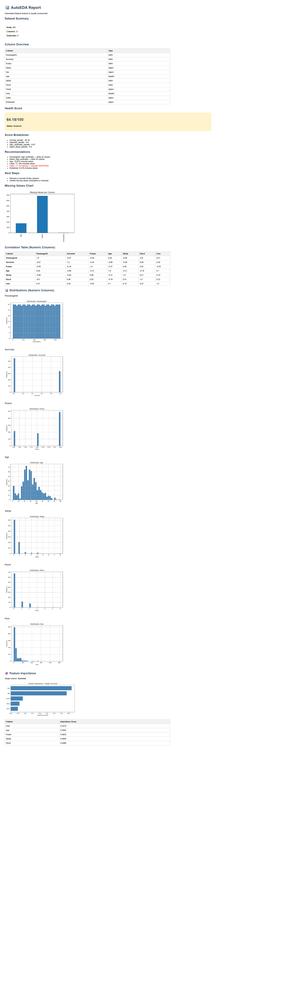

# 📊 AutoEDA — Automated Dataset Analysis & Quality Scoring

AutoEDA is a lightweight tool that automatically analyzes datasets, evaluates data quality, and generates a clean HTML report with actionable insights.

---

## 🚀 Features

* 📦 Load and analyze CSV datasets instantly
* 📊 Dataset summary (rows, columns, duplicates, data types)
* ⚠️ Automatic issue detection:
  * Missing values (with significance threshold)
  * ID-like columns
  * Incorrect data types (e.g., dates as strings, numeric-looking objects)
* 🧠 Smart recommendations for data cleaning
* 📈 Dataset Health Score (0–100) with penalty breakdown
* 🔗 Correlation table for numeric columns (highlights strong correlations)
* 📊 Distribution charts for all numeric columns
* 🎯 Feature importance (specify a target column for ML insights)
* 📝 Export-ready HTML report

---

## 🧠 Example Output (Titanic Dataset)

* Health Score: **64.18 / 100 (Moderate)**
* Identified issues:
  * Cabin: 77.1% missing → DROP recommended
  * Age: 19.87% missing → needs imputation
  * PassengerId, Name detected as ID columns → excluded from analysis
* Top features influencing `Survived`: **Fare, Pclass, Age**

---

## 📸 Report Preview



---

## ⚙️ Installation
```bash
git clone https://github.com/ChiragSharma2026/autoeda-pro.git
cd autoeda-pro
pip install pandas matplotlib scikit-learn
```

---

## ▶️ Usage

**Basic analysis:**
```bash
python loader.py your_dataset.csv
```

**With feature importance:**
```bash
python loader.py your_dataset.csv --target ColumnName
```

👉 Both generate `report.html` — open in any browser.

**Web Dashboard:**
```bash
streamlit run app.py
```
Upload any CSV and explore interactively in your browser.

**Example:**
```bash
python loader.py titanic.csv --target Survived
```

---

## 📁 Project Structure
```
autoeda-pro/
│── loader.py            # Main entry point + CLI
│── analyzer.py          # Dataset analysis + correlations
│── recommendations.py   # Suggestions engine
│── health.py            # Scoring system
│── insights.py          # Feature importance (RandomForest)
│── report.py            # HTML report generator
```

---

## 🎯 Why this project?

Most EDA tools give statistics.

AutoEDA focuses on:
👉 **actionable insights + dataset quality scoring**

---

## 🚧 Future Improvements
* CLI packaging (`pip install autoeda-pro`)
* SHAP-based explainability
* Deploy to Streamlit Cloud (public URL)

---

## 👨‍💻 Author

**Chirag Sharma**  
BTech CSE | Data Analytics & ML Enthusiast
